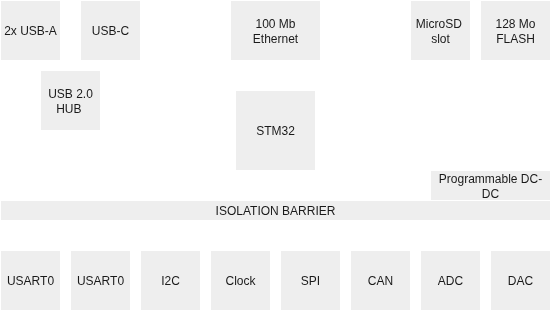

# EtherBench

EtherBench is an open hardware debugger based on four components:

- A [hardware probe](https://github.com/lheywang/EtherBenchProbe), based on an STM32H5 and it's [firmware, in C / C++](https://github.com/lheywang/EtherBenchFirmware).
- A [gui](https://github.com/lheywang/EtherBenchApp) app,based on Qt
- A [C software library](https://github.com/lheywang/EtherBenchLib), to extend the debug ability.

The goal is to be able to program, test and debug MCUs and MPUs without hassle.

This repo is actually the top level, and only hold the documentation. All subrepos are added as submodules.

## Hardware :

This tool is built around an STM32H563 MCU which act as the core of the probe.

On the device edge, a set of IO are available, which include :

- 1x full featured USART (RX & TX & RTS & CTS), up to 20 Mbps.
- 1x minimal usart (RX & TX), up to 20 Mbps.
- 1x I2C, up to 1 Mbps.
- 1x SPI, up to 50 Mbps.
- 1x CAN.
- 1x Clock (derived from the MCU clock tree).

Some analog features :

- 2x 12 bits, analog input.
- 1x 12 bits, analog output.

All of these features are behind an isolation barrier, ensuring the device safety.
A short circuit on the tested board won't damage the core, and by extension, the host.

> [!IMPORTANT]
> The isolation barrier is designed to provide voltage level switching, as well as basic
> isolation. It is **NOT** fully compliant to the latests standards. Therefore, for main
> powered devices, or where the voltage could be lethal, use the proper isolator for your
> safety.

To extend theses options, some options for the host side:

- 1x SD card, to store logs.
- 1x 128 MB of onboard flash.
- 1x 100 Mb Ethernet port.
- 1x USB-C device.
- 2X USB-A host.

The memory can be used, without any distinctions to store any relevant data: Firmware to be flashed, logs, or test sequences.

The USB-C port is used for power, a 10W charger is required, where a 15W one is recommended.

Both the USB-C and Ethernet port may be used for communication with the host. Prefer Ethernet, as it's isolated and can provide an higher bandwidth.

All of that fit within a 110 x 110 mm case, which hold all of the electronic circuit over two layer of PCB. The main one, a 6 layer, and the top one, a two layer board.

## Communications

The board has two sets of IO, as USB and Ethernet. Any features can be used from both, but for the greatest experience, both can be used.

Once connected, the device expose itself as a lot of device :

### USB

On the USB side, three peripherals are exposed:

- EtherBench-Terminal: A VCOM port, used as a terminal to send commands.
- EtherBench-Bridge: Another VCOM port, but reserved for the UART0 communication. Most basic feature here.
- EtherBench-Probe: A CMSIS-DAP compatible probe, ready to be used from any programmer software.

### Ethernet

On the network side, the stack is a bit dlfferent. No devices are shown, but multiple ports are open:

- 20 & 21: An FTP server, to access the file systems.
- 23: A Telnet console, to be used within command line interface.
- 5025: An SCPI compliant device.
- XX: A Streaming port, can be configured. Used to transfer large volume of data without the hassle of SCPI commands.

### Consoles

As previously shown, multiple consoles are available. These are terminals that could be openned by users to interract with the device. All of them are strictly identical.

### Routers

Any IO can be muxed to any sink of data, including file systems. This can be configured from the command line.

| Interface     | IO Method                   |
| :------------ | :-------------------------- |
| File transfer | FTP (or unplug the SD card) |
| USART Bridge  | Both, USB preferred         |
| Debugging     | Both                        |
| Terminal      | Both, Ethernet preferred    |

This enable advanced features like deferred logging, or different outputs.

## Software :

There's quite a lot of software on this project, at different layers.

### Embedded

First, the embedded C/C++ app. This one runs on the probe, on the STM32 flash. It's based on ThreadX with extensions, and manage everything:

- NetXDuo: Network stack, including DHCP and server.
- USBX: USB stack, that handle the VCOM and custom class.
- LevelX: Flash wear leveling management.
- FileX: Filesystems

Some functions are also reused from the C standard library, thus file handling is possible within this project. The memory is shown after.

On top of that, a set of different tasks communicate with others to provide all the features. A full graph is available right under that paragraph.

[todo export drawio]

Each of these are designed to provide performance while remaining simple to maintain.

All of that code is available on the /src folder of that repo. Build and debug configurations are also available.

### Desktop App

A desktop app, wrote in pure C++ to provide graphics features to the project. While it's designed to mainly operate with the probe, its not designed to be exclusive. No commands are hardcoded.

The app provide a GUI to most settings and features, while also providing data analysis features, from stored buffers. This include:

- A serial interface gui
- A memory buffer management gui
- A data analysis tool
- Probe configuration menu.

It's designed to use the capacities of our desktop pc to provide an higher level of features, that could not be possible on an embdded app.

The GUI can be used as a stabdadone tool, it does not require any board to be wired.

### Library

The library is a fully optionnal brick, that can be placed between each. It's based on pure C implementation, to be runned on any architecture that exists.

Can be used to format messages and buffer before sending them over any buses. The desktop app will then be able to parse them, and provide more infos than just the value itself, such as timestamps, formats and so on.

### Scripting

There's two layer of scripting available on the tool. One that run on the device, and one from the desktop app.

#### Device scripts

The device can execute simple sequences of opererations, that can be triggered from any inputs, including a button press.

The scripts are quite limited, as it does not support advanced conditions and advanced programming methods.

These are aimed at simple series of operations, for exemple the programming of a chip.

As the file is easy to parse, and is directly converted into hardware commands, the timings constraints are extremely tight.
This is indeed a nice feature, which may be required, but also very limitating: Only very basic structures are possible.
I mean, only if, no else, no variable, no loop. Just, send that text over UART if last operation suceeded.

For more advanced scripting, as the device support SCPI commands, follow that route. This is supported by most, if not all
tools (Python (pyvisa), LabVIEW...). Otherwise, you may be using the desktop app, which expose a native python interpreter, with
some pre-included classes and tools to make the IO faster (as the VISA is then handled within a C++ class).

#### Desktop scripts

The GUI App provide python interpreter option, from an isolated thread. It include a library by default to provide IO features from the device without typing complex commands.

This enable more complex conditions, loop, and computations. But, you're loosing the timings constraints as you're going through a lot of layers. These scripts can call device scripts to offer an alternative.

Generally, I greatly recommand using this method over the first one.

## Memory map

Finally, here under what names and what size the different elements are available. The three first are located on the internal flash.
Therefore, they're soldered onto the board, and always available.

|   Volume    |    Size     | Usage                                                                                                           |
| :---------: | :---------: | :-------------------------------------------------------------------------------------------------------------- |
| /settings/  |   128 Ko    | Device config. Proprietary Binary format only.                                                                  |
| /backtrace/ |   128 Ko    | Target crash dump (if any). Proprietary Binary format only.                                                     |
|   /flash/   |   127 Mo    | Firmwares to be flashed, sequences. Anything that may be executed.                                              |
|    /sd/     | Up to 32 GB | Same as flash, actually more oriented to outputs, as it can be read by any other device with an SD slot (FAT32) |

> [!WARNING]
> The SD card **WILL** be formatted as FAT32 immediately after being inserted, or at the next boot. Thus, use only device that may contain
> important data.

## Licenses

The project is under a GPL 3.0 License, as I want to leave the project open for anything, but, don't want to provide an income source from it.
Another license, the CERN-OHL 3.0 is added and restraint the boards.

The later ones aren't commited onto this repo, as I'm using Altium Designer, which rely on heavy binary files, that has nothing to do within a git repo.
Thus, the project isn't pushed, but, is available under the release panes, within a nicely zip archive. The license apply therefore to these files.

## Contributing

The project is open to any help, under any forms.
Knowledge about all topics aren't required.

If some doesn't know what's needed, here some ideas, which are on my todo-list, for one day.

- Support for commercial probes on the Qt App.
- Extend the SCPI functions and abilities
