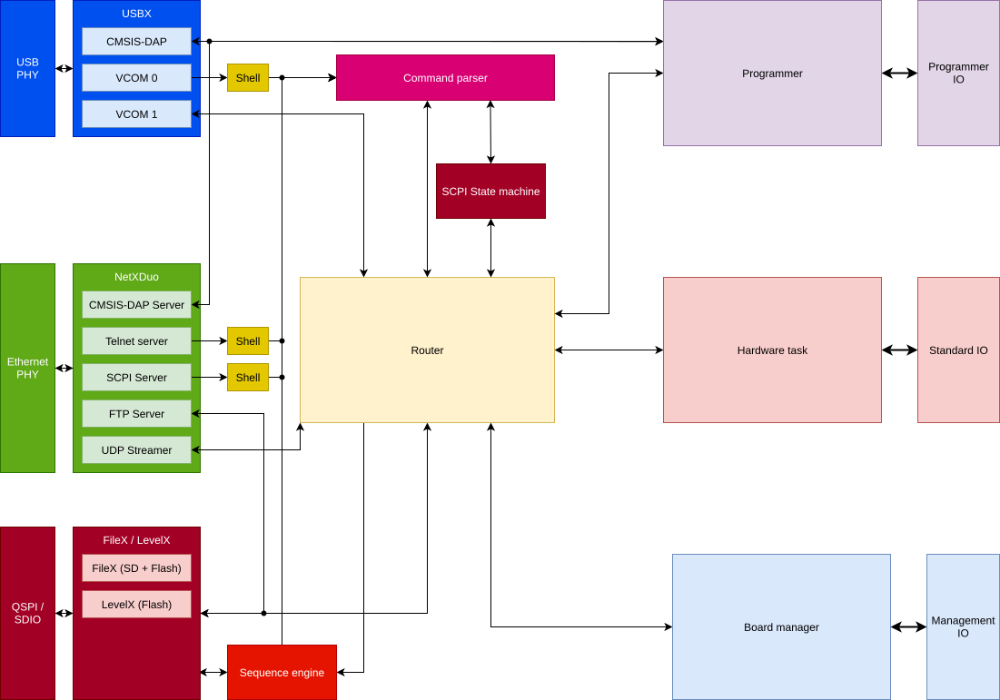

# Architecture

For this last parts, the documentation address more to developper, or just hobbyist which want to understand how the device work.
This chapter is far from being mandatory, in fact, I do not recommended reading it if you're only willing to use the device as a tool.

In this chapter, topics like the software stack, the services we're running and advanced tricks to turn standard peripherals into a SWD / JTAG master
will be described.

## Global architecture

On the software side, the global software architecture is done on different threads, using the Eclipse ThreadX RTOS as a base.

All of the different threads are going to be described on their own pages. The remaining 