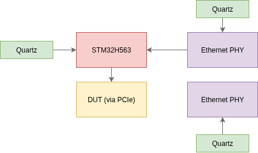

# Clocking

## Structure

The EtherBench motherboard integrates multiple independent clock domains to ensure optimal signal integrity and flexibility.
The primary system clock is derived from an external 8 MHz HSE oscillator.

The STM32H5 uses its internal Main PLL (PLL1) to scale this reference up to a 250 MHz core clock, while its Master
Clock Output (MCO1) is routed to the PCIe extension connector to provide a highly configurable clock source for the DUT.
Both the Ethernet PHY and USB Hub are autonomous regarding the clocks, as they each have a quartz. The Ethernet PHY provide a clock output,
which is used by the Ethernet peripheral.

## Clock outputs

The STM32 provide a clock output, variable for the DUT. There's two choices :

- The core clock, at 250 MHz
- The HSI oscillator, at 64 MHz.

### Available rates

A hardware integer division factor (from 1 to 15) can be applied to either source. While the hardware can physically
output high-frequency signals, it is strongly recommended to limit the MCO1 frequency to 64 MHz to preserve signal integrity
across the connector interface.

The available output frequencies are mapped below:

| **Divisor** |  **HSI64**   |    **PLL**    |
| :---------: | :----------: | :-----------: |
|    **1**    |  **64 MHz**  |   _250 MHz_   |
|    **2**    |  **32 MHz**  |   _125 MHz_   |
|    **3**    | _21.33 MHz_  |  _83.33 MHz_  |
|    **4**    |  **16 MHz**  |  _62.5 MHz_   |
|    **5**    | **12.8 MHz** |  **50 MHz**   |
|    **6**    | _10.66 MHz_  |  _41.66 MHz_  |
|    **7**    |  _9.14 MHz_  |  _35.71 MHz_  |
|    **8**    |  **8 MHz**   | **31.25 MHz** |
|    **9**    |  _7.11 MHz_  |  _27.77 MHz_  |
|   **10**    | **6.4 MHz**  |  **25 MHz**   |
|   **11**    |  _5.81 MHz_  |  _22.72 MHz_  |
|   **12**    |  _5.33 MHz_  |  _20.83 MHz_  |
|   **13**    |  _4.92 MHz_  |  _19.23 MHz_  |
|   **14**    |  _4.57 MHz_  |  _17.85 MHz_  |
|   **15**    |  _4.26 MHz_  |  _16.66 MHz_  |

The rates shown in bold are preferred, as they're:

- standard rates in the industry
- round integer, thus limited the error.

### Selection Behavior

When a specific frequency is requested via the CLI or API, the configuration algorithm automatically biases its
choice toward these preferred bold values by expanding their error tolerance window to three times that of the non-standard (italic) rates.
