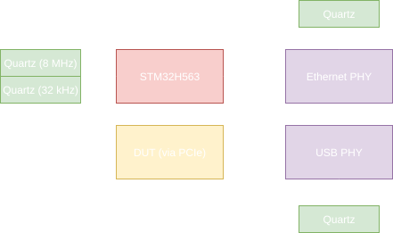

# Clocking

## Structure

The EtherBench motherboard integrates multiple independent clock domains to ensure optimal signal integrity and flexibility.
The primary system clock is derived from an external 8 MHz HSE oscillator.

The STM32H5 uses its internal Main PLL (PLL1) to scale this reference up to a 250 MHz core clock, while its Master
Clock Output (MCO1) is routed to the PCIe extension connector to provide a highly configurable clock source for the DUT.
Both the Ethernet PHY and USB Hub are autonomous regarding the clocks, as they each have a quartz. The Ethernet PHY provide a clock output,
which is used by the Ethernet peripheral.

## Clock outputs

The STM32 provide a clock output, variable for the DUT. There's two choices :

- The core clock, at 250 MHz
- The HSI oscillator, at 64 MHz.

### Available rates

A hardware integer division factor (from 1 to 15) can be applied to either source. While the hardware can physically
output high-frequency signals, it is strongly recommended to limit the MCO1 frequency to 64 MHz to preserve signal integrity
across the connector interface.

The available output frequencies are mapped below:

| **Divisor** |  **HSI64**  |    **PLL**    |  **HSI48**  |   **HSE**   |    **LSE**     |
| :---------: | :---------: | :-----------: | :---------: | :---------: | :------------: |
|    **1**    | **32 MHz**  |   _250 MHz_   | **48 MHz**  |  **8 Mhz**  | **32.768 kHz** |
|    **2**    | **16 MHz**  |   _125 MHz_   | **24 MHz**  |  **4 MHz**  | **16.384 kHz** |
|    **3**    | _10.66 MHz_ |  _83.33 MHz_  | **16 MHz**  | _2.66 MHz_  |  _10.923 kHz_  |
|    **4**    |  **8 MHz**  |  _62.5 MHz_   | **12 MHz**  |  **2 MHz**  | **8.192 kHz**  |
|    **5**    | **6.4 MHz** |  **50 MHz**   | **9.6 MHz** | **1.6 MHz** |  _6.554 kHz_   |
|    **6**    | _5.33 MHz_  |  _41.66 MHz_  |  **8 MHz**  | _1.33 MHz_  |  _5.461 kHz_   |
|    **7**    | _4.57 MHz_  |  _35.71 MHz_  | _6.85 MHz_  | _1.14 MHz_  |  _4.681 kHz_   |
|    **8**    |  **4 MHz**  | **31.25 MHz** |  **6 MHz**  |  **1 MHz**  | **4.096 kHz**  |
|    **9**    | _3.55 MHz_  |  _27.77 MHz_  | _5.33 MHz_  |  _888 kHz_  |  _3.641 kHz_   |
|   **10**    | **6.4 MHz** |  **25 MHz**   | **4.8 MHz** | **800 kHz** |   _3.27 kHz_   |
|   **11**    | _2.90 MHz_  |  _22.72 MHz_  | _4.36 MHz_  |  _727 kHz_  |  _2.979 kHz_   |
|   **12**    | _2.66 MHz_  |  _20.83 MHz_  |  **4 MHz**  |  _666 kHz_  |  _2.731 kHz_   |
|   **13**    | _2.46 MHz_  |  _19.23 MHz_  | _3.69 MHz_  |  _610 kHz_  |  _2.521 kHz_   |
|   **14**    | _2.28 MHz_  |  _17.85 MHz_  | _3.42 MHz_  |  _570 kHz_  |  _2.341 kHz_   |
|   **15**    | _2.13 MHz_  |  _16.66 MHz_  | **3.2 MHz** |  _533 kHz_  |  _2.185 kHz_   |

!!! info "Rate selection"
    The rates in **bold** shall be preferred over the others, as they're integer values, and therefore, more accurates. 

### Selection Behavior

When a specific frequency is requested via the CLI or API, the configuration algorithm automatically biases its
choice toward these preferred bold values by expanding their error tolerance window to three times that of the non-standard (italic) rates.

In any cases, the selected value **will** be one of the table. Physically, it's not possible to generate any other rate, from hardware limitations.
Therefore, for very specific request, the command can introduce an error. The command will return the applied frequency.
